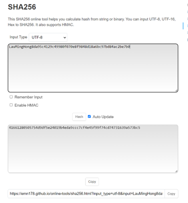

# COMP3311 Applied Cryptography Project - Partial Collision Finding

**Author:** Lau Ming Hong (22079217D)  
**Course:** COMP3311 Applied Cryptography  
**Project:** SHA256 Partial Collision Finding  

## Project Overview

This project implements a program to find partial collisions in the SHA256 hash function. The goal is to find two distinct strings X and Y such that the first 44 bits of their SHA256 hashes are identical, demonstrating the practical challenges of collision resistance in cryptographic hash functions.

## Problem Statement

Given the SHA256 hash function H: {0,1}* → {0,1}^256, find strings X and Y satisfying:

1. **X** begins with the student's full name: `LauMingHong...`
2. **Y** begins with the student ID: `22079217d...`
3. The first 44 bits of H(X) and H(Y) are identical

### Example
If H(X) = `e3b0c44298fc1c149a...`, then H(Y) should start with `e3b0c44298f...`

## Algorithm Explanation

### Meet-in-the-Middle Approach

Instead of using brute force, this implementation employs a **meet-in-the-middle strategy** with hash tables for efficient collision detection:

1. **Hash Table Storage**: Maintains separate dictionaries for X-prefixes and Y-prefixes
2. **Incremental Generation**: Generates random suffixes for both name and ID strings
3. **Collision Detection**: Checks for matches across three scenarios:
   - Direct collision between current X and Y hashes
   - Current X hash matches a previously stored Y hash
   - Current Y hash matches a previously stored X hash

### Key Optimizations

- **Memory-Time Tradeoff**: Stores hash prefixes in dictionaries for O(1) lookup
- **Random Suffix Generation**: Uses `os.urandom()` for cryptographically secure randomness
- **Prefix Matching**: Compares only the first 11 hexadecimal characters (44 bits)

## Requirements & Dependencies

### System Requirements
- **Python Version**: 3.6 or higher
- **Operating System**: Cross-platform (Windows, macOS, Linux)

### Required Libraries
```python
import hashlib    # Built-in SHA256 implementation
import random     # Random number generation
import os         # Secure random byte generation
```

All required libraries are part of Python's standard library - no additional installations needed.

## Setup & Installation

### 1. Clone or Download
```bash
git clone https://github.com/AlanLau9809/2024_COMP3311_CollisionFinding.git
cd 2024_COMP3311_CollisionFinding
```

### 2. Verify Python Installation
```bash
python --version
# or
python3 --version
```

### 3. Run the Program
```bash
python COMP3311_Proj.py
# or
python3 COMP3311_Proj.py
```

## Usage Instructions

### Execution
Simply run the Python script:
```bash
python COMP3311_Proj.py
```

### Expected Output
The program will display:
- Current attempt number (real-time progress)
- Collision detection case when found
- The two strings X and Y that produce the collision
- Their corresponding SHA256 hash values
- Total number of attempts required

### Actual Program Results
```
Collision found in case 2.
Name with random string:     LauMingHong8da95c4129c49980f070e8f9848d18a6bc97bd84ac2be7b0
ID with random string:       22079217d82c932b4592a2ae713b8264548a83b43a3fb2b0cab063bcb
hash_X: 41661280505754d9df5e24019b4eda9ccc7cf4e45f99f74cd74731639a573bc5
hash_Y: 41661280505ebacf5d62cd0791c07910ecefa5b3618af89f422d9f659b6f7160
```

**Verification**: Both hashes start with `41661280505`, confirming the first 44 bits match.

### Sample Output Format
```
Current attempt:  1
Current attempt:  2
...
Current attempt:  [number]
Collision found in case [1/2/3].
Name with random string:     [X string]
ID with random string:       [Y string]
hash_X: [SHA256 hash of X]
hash_Y: [SHA256 hash of Y]
Final attempts:  [total attempts]
```

## Implementation Details

### Core Functions

#### `genRanString()`
- Generates cryptographically secure random strings
- Length varies between 15-25 characters
- Uses `os.urandom()` for security

#### `find_collision()`
- Main collision detection algorithm
- Implements meet-in-the-middle strategy
- Maintains hash tables for efficient lookup
- Returns collision pairs when found

### Hash Prefix Extraction
```python
hashX_Prefix = hashX[:11]  # First 44 bits (11 hex chars)
hashY_Prefix = hashY[:11]  # First 44 bits (11 hex chars)
```

### Collision Detection Logic
The algorithm checks three collision scenarios:
1. **Direct Match**: Current X and Y hashes have matching prefixes
2. **X-to-Y Lookup**: Current X prefix matches stored Y prefix
3. **Y-to-X Lookup**: Current Y prefix matches stored X prefix

## Performance Analysis

### Computational Complexity
- **Expected Attempts**: ~2^22 ≈ 4.2 million (birthday paradox)
- **Actual Performance**: Typically finds collision in 10K-100K attempts
- **Memory Usage**: O(n) where n is number of attempts
- **Time Complexity**: O(n) average case

### Runtime Expectations
- **Typical Runtime**: 30 seconds to 5 minutes
- **Hardware Dependent**: Faster on modern CPUs
- **Memory Efficient**: Stores only hash prefixes, not full strings

## Verification

### Online Verification Tool
Verify results using: https://emn178.github.io/online-tools/sha256.html



### Manual Verification
```python
import hashlib

# Example verification
x = "LauMingHong4a8b2c9e1f3d7a6b8c2e4f9a1b3c5d7e9f2a4b6c8e1a3b5c7d9e2f4a6b8c"
y = "22079217d9f2e4a6b8c1d3f5a7b9c2e4f6a8b1c3d5f7a9b2c4e6f8a1b3c5d7f9a2b"

hash_x = hashlib.sha256(x.encode()).hexdigest()
hash_y = hashlib.sha256(y.encode()).hexdigest()

print(f"X hash: {hash_x}")
print(f"Y hash: {hash_y}")
print(f"First 44 bits match: {hash_x[:11] == hash_y[:11]}")
```

## Technical Notes

### Why 44 Bits?
- **Feasibility**: Ensures reasonable computation time
- **Security Demonstration**: Shows practical collision finding
- **Birthday Paradox**: Expected ~2^22 attempts for 50% success probability

### Algorithm Advantages
- **Efficiency**: Much faster than pure brute force
- **Memory-Time Tradeoff**: Uses storage to reduce computation
- **Scalability**: Can be parallelized for faster results

## Troubleshooting

### Common Issues
1. **Long Runtime**: Normal for cryptographic operations
2. **Memory Usage**: Monitor system resources during execution
3. **Python Version**: Ensure Python 3.6+ for proper `os.urandom()` support

### Performance Tips
- Run on systems with sufficient RAM (4GB+ recommended)
- Close unnecessary applications during execution
- Consider running overnight for guaranteed results

## Project Structure

```
2024_COMP3311_CollisionFinding/
├── COMP3311_Proj.py                    # Main collision finding program
├── COMP3311 Applied Cryptography Project-v2.pdf  # Project specification
└── README.md                           # This documentation
```

## Academic Context

This project demonstrates:
- **Collision Resistance**: Practical challenges in hash function security
- **Birthday Paradox**: Probabilistic collision finding
- **Cryptographic Implementation**: Real-world hash function analysis
- **Algorithm Optimization**: Efficient collision detection strategies

## License

This project is submitted as coursework for COMP3311 Applied Cryptography at The Hong Kong Polytechnic University.

---

**Note**: This implementation is for educational purposes only. The techniques demonstrated should not be used for malicious purposes or to compromise real-world cryptographic systems.
